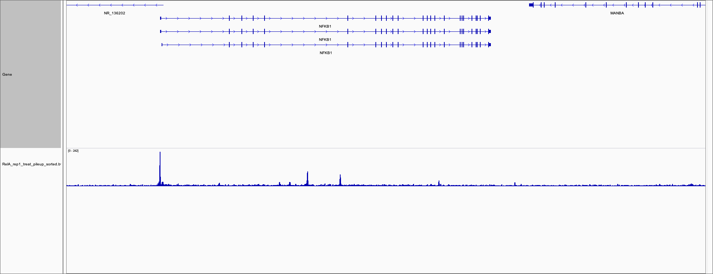
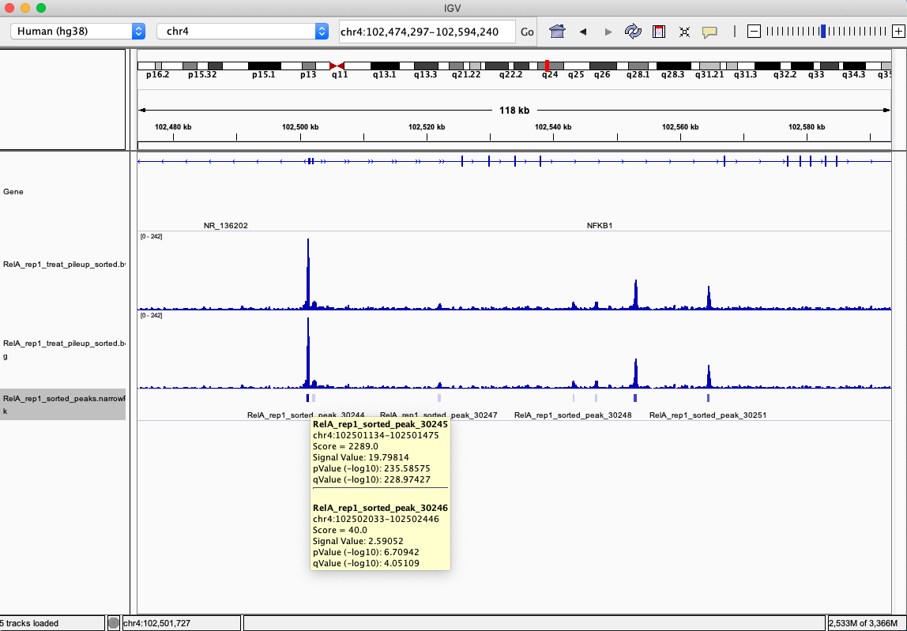
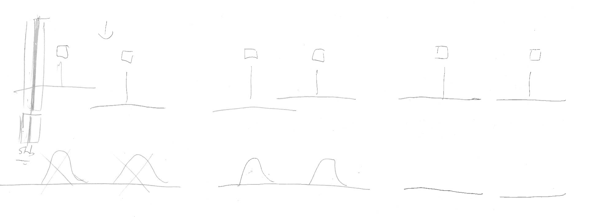

# ChIPseq_Workflow
## 1. FastQC
FastQC aims to provide a simple way to do some quality checks on raw sequence data coming from high throughput sequencing pipelines. It can give us a quick impression of whether the data has any problems that we should be aware of before doing any further analysis.

The data for the NF-$\kappa$B project can be found in `/home/data/projects/nfkb`. 
To unzip `.gz` files, we can use `zcat`. To view the head of a `.gz` file, use:
```
$ zcat filename.fastq.gz | head
```
To view the head already unzipped files, use:
```
$ cat file.txt | head
```
To run fastqc on a dataset:
```
$ fastqc [-o output dir] seqfile1 .. seqfileN
$ fastqc -o /home/ellora/output/RelA_rep1 RelA_rep1.fastq.gz
```
View other options for `fastqc` by typing `fastqc --help` in the command line. 

Once the output file has been generated, use `rsync` to transfer the output files into your local machine.
```
$ rsync [options] [SRC] [DEST]
$ rsync ellora@cbio.yale-nus.edu.sg:/home/ellora/output/[folder_name]/* ~/Desktop/nfkb/[folder_name]
```
The * indicates all files in the specified folder.

**Note:** You have to exit `ssh` to use `rsync`. Also, depending on your machine, you may or may not get an error message that says `/etc/profile.d/lang.sh: line 19: warning: setlocale: LC_CTYPE: cannot change locale (UTF-8): No such file or directory` but files will have been transferred - check local machine output folder to verify!

[This](https://www.bioinformatics.babraham.ac.uk/projects/fastqc/Help/) is a really good resource to read more about FastQC and the analysis modules found in the fastqc HTML report. 

## 2. BWA Workflow
BWA is a software package for mapping low-divergent sequences against a large reference genome, such as the human genome.

### 2.1 BWA Index
BWA first needs to construct the FM-index for the reference genome. This step only needs to be done **once** and may take a while as it prepares the Burrows Wheeler Transform index for the reference, allowing the aligner to locate where your reads map within that reference.
```
$ bwa index [ref.fa]
$ bwa index hg38.fa
```
Once you have finished preparing your indexed reference you can map your reads to the reference. For our project, the BWA index can be found in `/home/shared/genomes/hg38/BWAIndex`.

### 2.2 BWA Alignment
### Single-end Reads
```
$ bwa aln [-t threads] [ref.fa] [in.fq] > [out.sai]
$ bwa aln -t 10 hg38.fa /home/ellora/data/RelA_rep1/RelA_rep1.fastq.gz > RelA_rep1.sai
```
`bwa aln` gives us `.sai` files which we need to convert to `.sam` files through `bwa samse`:
```
$ bwa samse [-r '@RG\tID:foo\tSM:bar'] [ref.fa] [in.sai] [in.fq] > [out.sam]
$ bwa samse /home/ellora/data/BWAIndex/hg38.fa RelA_rep1.sai /home/ellora/data/RelA_rep1/RelA_rep1.fastq.gz > RelA_rep1.sam
```
[The BWA manual](http://bio-bwa.sourceforge.net/bwa.shtml) for explains more on the other sub-commands and options available for use with the `bwa` command. 
### Paired-end reads
For paired end reads:
```
$ bwa aln [-t threads] [ref.fa] [reads1.fq] > [reads1.sai]
$ bwa aln [-t threads] [ref.fa] [reads2.fq] > [reads2.sai]
```
```
$ bwa sampe [-r '@RG\tID:foo\tSM:bar'] [ref.fa] [reads1.sai] [reads2.sai] [reads1.fq] [reads2.fq] > [aligned_pairs.sam]
```
#### Read Groups
**Note:** Make sure to include the quotation marks when including the `-r` option. 

There is no formal definition of what a read group (RG) `'@RG\tID:foo\tSM:bar'` is, but in practice, this term refers to a set of reads that were generated from a single run of a sequencing instrument.

In the simple case where a single library preparation derived from a single biological sample was run on a single lane of a flowcell, all the reads from that lane run belong to the same read group. If multiplexing is involved, then each subset of reads originating from a separate library run on that lane will constitute a separate read group.

* **ID = Read group identifier**. This tag identifies which read group each read belongs to, so each read group's ID must be unique.
* **SM = Sample**. The name of the sample sequenced in this read group. 

### 2.3 Samtools
Refer to the [samtools manual](http://www.htslib.org/doc/samtools.html) for more subcommands and options.

#### 2.3.1 view
We need to convert the `.sam` files into `.bam` files.
```
$ samtools view [-@ threads] [other options] [in.sam] > [out.bam]
$ samtools view -@ 10 -Sb RelA_rep1.sam > RelA_rep1.bam
```
#### 2.3.2 sort
The `.bam` file must be sorted before indexing.
```
$ samtools sort [-@ threads] [in.bam] [-o out.bam]
$ samtools sort -@ 10 RelA_rep1.bam > RelA_rep1_sorted.bam
```
#### 2.3.3 index
The indexing part is needed to open the `.bam` files in Integrative Genomics Viewer (IGV). We get a `.bai` file.
```
$ samtools index [in.bam]
$ samtools index RelA_rep1_sorted.bam
```
It's generally good habit to view the data/reads in IGV as a qualitative quality control.

## 3. Peak Calling
Peak calling (converting reads in `.bam` to signal coverage), the next step in our workflow, is a computational method used to identify areas in the genome that have been enriched with aligned reads as a consequence of performing a ChIP-sequencing experiment. There are various tools that are available for peak calling, the one that we will be using is MACS2.

### Without An Input File
```
$ macs2 callpeak [-t in.bam] [-n output NAME] [--bdg] [--outdir]
$ macs2 callpeak -t RelA_rep1_sorted.bam -n RelA_rep1 --bdg --outdir /home/ellora/output/RelA_rep1/macs2
```

### With An Input File
```
$ macs2 callpeak [-t in.bam] [-c control.bam] [-f format] [-n output NAME] [--bdg] [--outdir]
$ macs2 callpeak -t RelA_rep1_sorted.bam -c RelA_input.bam -f BAM -n RelA_rep1 --bdg --outdir /home/ellora/output/RelA_rep1/macs2
```

### For .broadPeak Files
Make sure that the **--broad flag** is included
```
$ macs2 callpeak [-t in.bam] [-c control.bam] [-f format] [-n output NAME] [--broad] [--bdg] [--outdir]
```

### For Paired-end Data
Note the change in **format** from **BAM to BAMPE**
```
$ macs2 callpeak [-t in.bam] [-c control.bam] [-f format] [-n output NAME] [--broad] [--bdg] [--outdir]
$ macs2 callpeak -t RelA_rep1_sorted.bam -c RelA_input.bam -f BAMPE -n RelA_rep1 --bdg --outdir /home/ellora/output/RelA_rep1/macs2
```

We can obtain a summary of **how many peaks** were called in each sample. We can do this by counting the lines in the .narrowPeak files:
```
$ wc -l file.narrowPeak
$ wc -l *.narrowPeak
$ wc -l RelA_rep1_sorted_peaks.narrowPeak
42732 RelA_rep1_sorted_peaks.narrowPeak
```
We can convert `.broadPeak` or `.narrowPeak` files into `.bed` files by using:
```
$ cut -f 1,2,3 peaks.* > peaks.bed
```
Check the data structure of a `.bed` file to make sure you're cutting the right columns 

**Note:** `.bedGraph` or `.bdg` files are not the same as `.bed` files.

If the `--bdg` flag is on, MACS2 will store the fragment pileup, control lambda in bedGraph files. The bedGraph files will be stored in the current directory named `NAME_treat_pileup.bdg` for treatment data, `NAME_control_lambda.bdg` for local lambda values from control. 

The `NAME_treat_pileup.bdg` and `NAME_control_lambda.bdg` files are in bedGraph format which can be imported to the UCSC genome browser or be converted into even smaller bigWig files. The `NAME_treat_pielup.bdg` contains the pileup signals (normalized according to --scale-to option) from ChIP/treatment sample. The `NAME_control_lambda.bdg` contains local biases estimated for each genomic location from the control sample, or from treatment sample when the control sample is absent. The subcommand `bdgcmp` can be used to compare these two files and make a bedGraph file of scores such as p-value, q-value, log-likelihood, and log fold changes.

In other words,

* `treat_pileup.bdg` is the file containing the reads that come from the ChIP experiment.
* `control_lambda.bdg` is the file containing the background reads i.e. what MACS2 estimates the background level of reads to be. If we had an input sample (random background reads), `control_lambda.bdg` would contain the reads from the input sample instead.

More modules and options for MACS2, as well as a more detailed explanation on what each output files is, [here](https://github.com/taoliu/MACS). 

### 3.1 bedGraphToBigWig
[This](https://genome.ucsc.edu/FAQ/FAQformat.html#format6.1) gives a brief explanation on the bedGraph and bigWig formats. See an example of creating a bigWig track from a bedGraph file [here](https://genome.ucsc.edu/goldenPath/help/bigWig.html#Ex3).

Before converting `.bdg` files to `.bw` files, the `.bdg` files must first be sorted. Note that `.bdg` and `.bedGraph` are referred to interchangeably.
```
$ sort -k1,1 -k2,2n unsorted.bedGraph > sorted.bedGraph
$ sort -k1,1 -k2,2n unsorted.bdg > sorted.bdg
```
Then we convert `.bdg` files to `.bw` files using:
```
$ bedGraphToBigWig [in.bedGraph] [chrom.sizes] [out.bw]
$ bedGraphToBigWig RelB_rep1_treat_pileup_sorted.bdg /home/ellora/data/hg38_chroms.size RelB_rep1_treat_pileup_sorted.bw
```
For our project, the `chrom.sizes` can be found in `/home/shared/genomes/hg38/hg38_chroms.size`.
  
Using `rsync`, we can transfer the `.bw` files to our local machine **to view the peaks in IGV**.



The `.bdg` and `.bw` graphs look the same, but the `.bw` file will load much faster (see figure below). We can also load the `.narrowPeak` file onto IGV to obtain information about the peaks. To better understand the `.narrowPeak` format, refer to [this](http://genome.ucsc.edu/FAQ/FAQformat.html#format12).



For samples with more than one replicate, we can load the `.bw` file of both replicates and compare the peaks. 

### Running ChIPQC
ChIPQC is a package for assessing quality of ChIP-seq samples and experiments. Click [here](https://bioconductor.org/packages/release/bioc/html/ChIPQC.html) for the ChIPQC Bioconductor page. The two libraries needed to run ChIPQC are:
```
library(ChIPQC)
library(TxDb.Hsapiens.UCSC.hg38.knownGene)
```
and it's more or less 3 lines of code (adjust parameters according to needs of experiment):
```
x = read.delim("batch2_samples.txt")
chip.qc = ChIPQC(x, annotation = "hg38")
ChIPQCreport(chip.qc)
```
# Steps 1 to 3 can be automated using shell scripts `.sh`! :)

## 4. Analysing Peak Data with R
### 4.1 GenomicRanges
The `GenomicRanges` **R package** defines general purpose containers for storing and manipulating genomic intervals and variables defined along a genome. There's plenty of documentation for `GenomicRanges` which can be found [here](https://bioconductor.org/packages/release/bioc/html/GenomicRanges.html).

The `GenomicRanges` package is available at https://bioconductor.org and can be installed via `BiocManager::install`:
```
if (!require("BiocManager"))
    install.packages("BiocManager")
BiocManager::install("GenomicRanges")
```
A package only needs to be installed once. Load the package into an R session with:
```
library(GenomicRanges)
```
### 4.2 Irreproducible Discovery Rate (IDR)
The `IDR` is a **R package** which measures consistency between replicates in high-throughput experiments. It also uses reproducibility in score rankings between peaks in each replicate to determine an optimal cutoff for significance. The reference manual for IDR can be found [here](https://cran.r-project.org/web/packages/idr/idr.pdf).

Some pointers on using IDR (obtained from [here](https://ccg.epfl.ch/chipseq/doc/data_repro/data_reproduction/cases/landt12/landt12_idr_repro.html)):

* The IDR algorithm requires sampling of both signal and noise distributions to separate the peaks into two groups. So, its recommended that peak calling is not very stringent.
* It is dominated by the weakest replicate. This means that if one replicate is poor, then many good peaks from the higher quality replicate will be rejected. 
    + To ensure similar weighting of individual replicates, the number of significant binding regions identified using IDR on each individual replicate (obtained by partitioning reads into two equal groups to allow the IDR analysis) is recommended to be within a factor of 2.
* We will need atleast two replicate for any ChIP-seq experiments for testing through IDR pipeline. The basic requirements are:
    + Peak files **MUST** be in narrowPeak format (and unzipped as the code currently doesn't handle zipped peak files directly).
    + The narrowPeak format has 3 columns that can be used to rank peaks (signal.value, p.value and q.value).
    + **p-value and q-value columns MUST be in -log10( ) scale**

To run IDR we use the `idr` command followed by any necessary parameters:
```
$ idr --samples SAMPLE SAMPLE --input-file-type {narrowPeak,broadPeak,bed} --rank {signal.value,p.value,q.value,columnIndex} --plot
$ idr --samples RelB_rep1_peaks.narrowPeak RelB_rep2_peaks.narrowPeak --input-file-type narrowPeak --rank p.value --plot
```
To see what parameters we have available to us, we can use:
```
$ idr -h
```
#### 4.2.1 Text Output
We get an output that looks like this:
```
Initial parameter values: [0.10 1.00 0.20 0.50]
Final parameter values: [1.53 0.57 0.81 0.37]
Number of reported peaks - 29579/29579 (100.0%)

Number of peaks passing IDR cutoff of 0.05 - 9092/29579 (30.7%)
```
There is also a output `.txt` file which mimics the input file type, with some additional fields. Note that the first 10 columns are a standard narrowPeak file, pertaining to the **merged peak across the two replicates**.

**Column 5** contains the scaled IDR value, `min(int(log2(-125IDR), 1000)`. For example, peaks with an IDR of 0 have a score of 1000, peaks with an IDR of 0.05 have a score of `int(-125log2(0.05)) = 540`, and IDR of 1.0 has a score of 0.

**Columns 11 and 12** correspond to the local and global IDR value, respectively.

* The **global IDR** is the value used to calculate the scaled IDR number in column 5, it is analogous to a multiple hypothesis correction on a p-value to compute an FDR.
* The **local IDR** is akin to the posterior probability of a peak belonging to the irreproducible noise component. You can read [this](https://projecteuclid.org/euclid.aoas/1318514284) super technical paper for more details.

**Columns 13 through 16** correspond to Replicate 1 peak data and **Columns 17 through 20** correspond to Replicate 2 peak data.

More of the output `.txt` file format can be understood [here](https://github.com/nboley/idr#output-file-format).

**Note:** For *raw* IDR values, a peak with 0.05 IDR means that peak has a 5% chance of being an irreproducible discovery (i.e. peaks with 0.00 IDR means it is very reproducible). However, if we look at column 5 of the output `.txt` file, a higher score means the peak is more reproducible.

#### 4.2.2 Plot Output

**Upper Left:** Replicate 1 peak ranks versus Replicate 2 peak ranks - peaks that do not pass the specified IDR threshold are coloured red.

**Upper Right:** Replicate 1 log10 peak scores versus Replicate 2 log10 peak scores - peaks that do not pass the specified IDR threshold are coloured red.

**Bottom Row:** Peak rank versus IDR scores are plotted in black. The overlayed boxplots display the distribution of IDR values in each 5% quantile. The IDR values are thresholded at the optimization precision - 1e^-6^ by default.

### 4.3 Combining 4.1 and 4.2
See `RelB_peak_analysis.R` in `Users/ellora/Desktop/chip_analysis`.

Some guiding questions to ask while doing analysis:

* What peaks are associated with what genes?
* Are the peaks overlapping with the actual gene, the promoter of that gene, or nothing at all?
    + If it's intergenic (not overlapping in promoter region or actual gene), what is the nearest gene?
    + How far away is the nearest gene? 
* How many peaks are associated with a specific gene?

## 5. GREAT
After identifying likely binding sites, downstream analyses will often include:

1. Identifying which genes are associated with the binding sites
2. Exploring whether there is any associated enrichment of processes, pathways, or networks

We will explore a web-based tool called [GREAT](http://great.stanford.edu/public/html/) for performing these analyses using our peak calls. Refer to [this](http://great.stanford.edu/help/display/GREAT/Output#Output-Genomicregionandgeneassociationsgraphs) to read an explanation on the output. 

### 5.1 Preparing the file for GREAT
We will use the peak calls output from the IDR analysis. Ideally we use the peaks that are reproducible, but sometimes we might have to do it with all peaks depending on the question. 

We then extract the first three columns of the IDR peak calls and convert it into a `.bed` file
```
$ cut -f 1,2,3 great_idr.txt > great_idr.bed
```

### 5.2 View
The View filter determines which tests to display in output tables based on their p-values and the statistical significance threshold applied. 

* **Significant by Both:** shows information only for terms that are statistically significant by *both the binomial and hypergeometric tests and that satisfy all other filter criteria (by default a binomial fold enrichment filter of 2 is set)*. 
* **Significant by Region-based Binomial:** shows rows that are *significant by the binomial test but may not be significant by the hypergeometric test*.
* **Ignore statistical significance:** reveals all test results that *satisfy all non-statistical-significance criteria (ie. it will display terms that are not statistically significant by one or both tests, but satisfy all other filters such as the fold enrichment, term and/or term annotation)*.

**Note:** You can change *View* under the **Global Controls** tab

## 6. Genomation
See `Genomation.R` in local machine.

It's important to note that when clustering with Genomation, first ordering the dataset into clusters before scaling it will give different clustering patterns than if you scaled the unordered data first and then cluster the scaled data. In HarmstonLab, we go by the convention of scaling it first before ordering it.  

**Note:** While reading in peak files, if you use the `remove.unusual` option in `readGeneric()`, the warning of `x windows fall off the target` will no longer appear.

## 7. Combining Peaks
A note when using `union()`, `reduce()`, and `resize()` on combining peaks 

